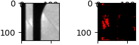

# anomaly-detection-3d-printing
During the 3d printing process potential anomalies are expected be supervised and warned. This model utilizing a AnoGAN to recognize possible anomalies appearing on layer image of the printing process.   


The red part indicates an anomaly caused high cumulated energy.  
# Image
The used image data is from a special camara equiped in the 3d printing machine, which takes picures during printing process for each layer. 

Inpute image is cut into smaller pieces in the size of 64x64. 
# Run
```
helper
   |--- anogan_model.py
   |--- dataload.py
anogan_train.py
anogan_detect.py
```
## Train
run anogan_train.py, then type in the path to training dataset. The trained weights are also stored. 
## Test
run anogan_detect.py, then type in the path to testing dataset.
